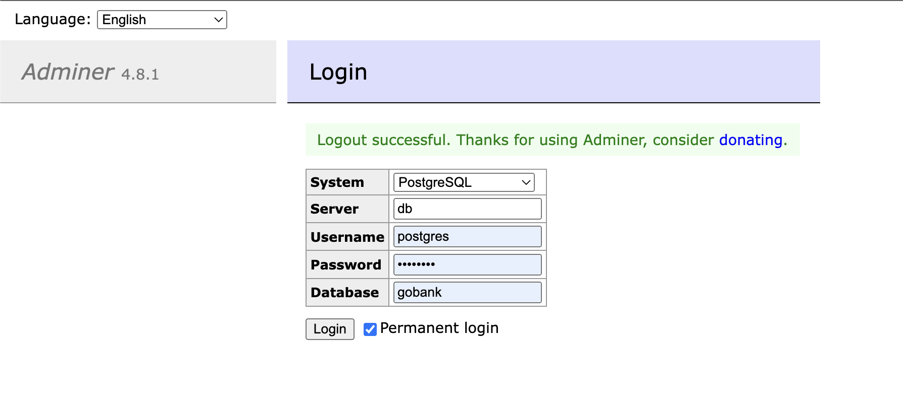

# Rest Apis Implementation In GO

## Go bank

Create

`curl --location --request PUT 'http://localhost:3000/accounts' \
  --header 'Content-Type: application/json' \
  --data '{
  "firstName": "Shiv",
  "lastName": "Singh",
  "number": 945557,
  "balance": 100000
  }'`

Update

`curl --location --request PUT 'http://localhost:3000/accounts/1' \
--header 'Content-Type: application/json' \
--data '{
"firstName": "Shiv",
"lastName": "Singh",
"number": 945557,
"balance": 100000
}'`

Get `http://localhost:3000/accounts`

Delete 
`curl --location --request DELETE 'http://localhost:3000/accounts/1' \
  --data ''`

## packages 
- Postgres
- Gorilla mux

## DB
- Postgres

## How to Run

- Create bin and postgres Dir in Current Working Directory
- Run `Docker compose up -d`
- Adminer Ui will be accessible on `http://127.0.0.1:8080`
- Connect To Postgres DB(Make Sure server name should be db because in docker-compose it is running as a service) 
- make run
